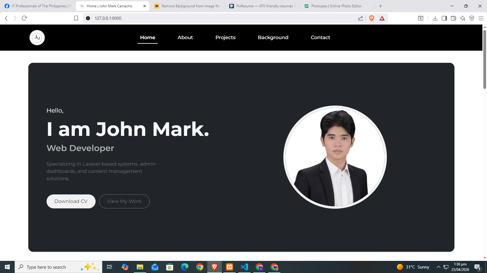
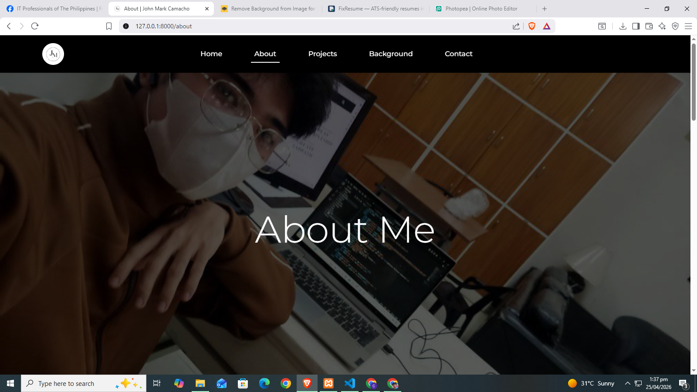
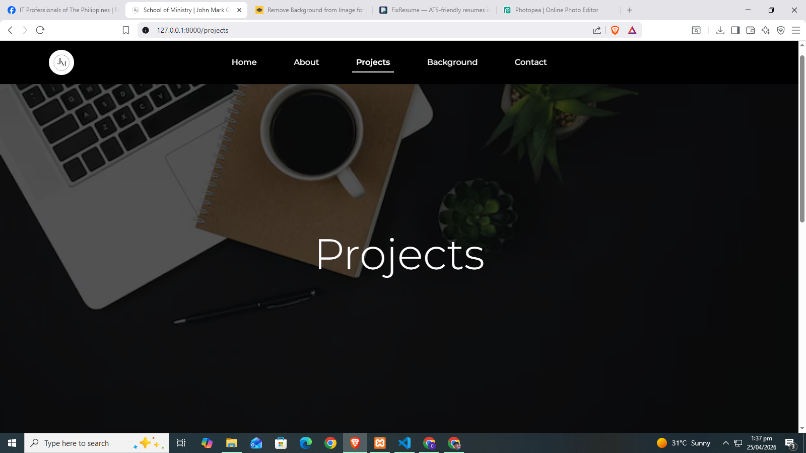
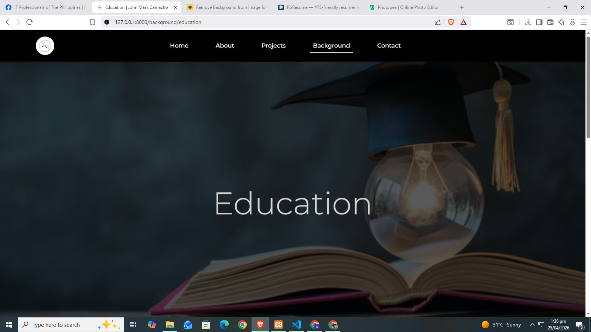
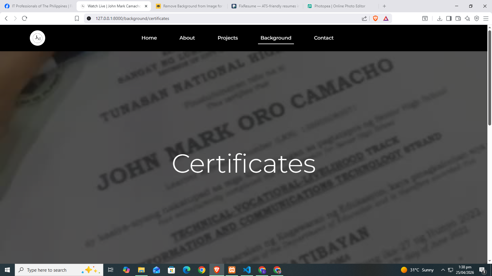
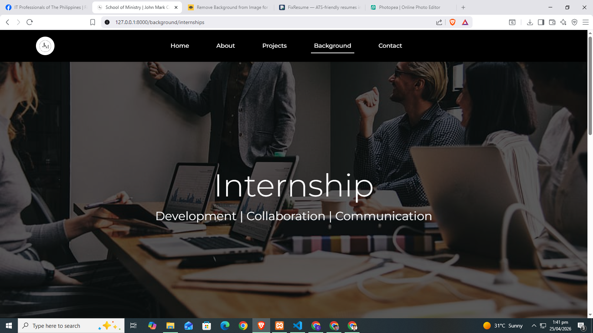

# My Portfolio

## 📌 About
Personal developer portfolio built with Laravel and Bootstrap, featuring an admin panel, authentication system, and CMS for managing content with a responsive UI.

## 🚀 Features
- Admin dashboard
- User authentication (login system)
- Content Management System (CMS)
- Responsive design

## 🛠️ Tech Stack
- Laravel
- Bootstrap
- PHP
- MySQL

## 📷 Screenshots

## 🚀 Overview
This is a Laravel-based personal portfolio website featuring:
- CMS-based structure
- Role-based access control
- Responsive design
- Admin dashboard system

### 🏠 Home Page

---

### 👤 About Page

---

### 💼 Projects Page

---

### 🎓 Background - Education

---

### 📜 Background - Certificates

---

### 🧑‍💼 Background - Internships

## ⚙️ Installation
1. Clone the repo
2. Run `composer install`
3. Run `npm install`
4. Set up `.env`
5. Run `npm run dev`
6. Run `php artisan migrate`
7. Run `php artisan serve`

## 📌 Status
Currently in development (not deployed)
